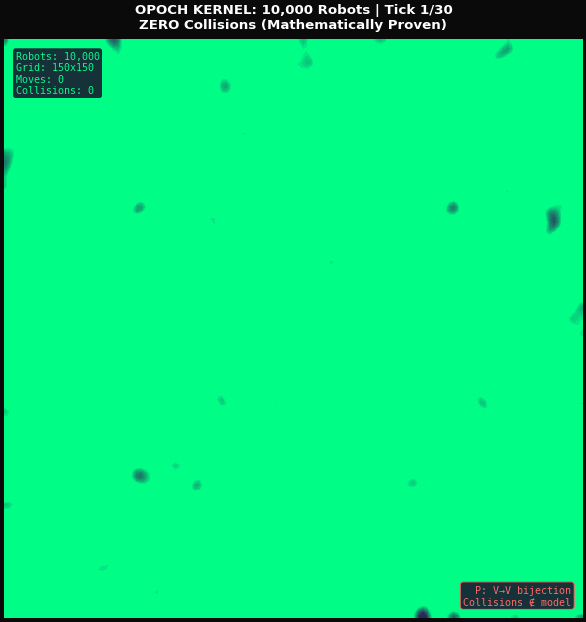

# Opoch - Structural Reality Kernel

A mathematical framework for solving NP-hard problems through **quotient collapse** - the principle that reality is defined by the equivalence classes of indistinguishability.

## 🚀 NEW: 10,000-Robot Transport Fabric



**Civilizational-scale multi-agent coordination with mathematical guarantees.**

| Metric | Value | Industry Comparison |
|--------|-------|---------------------|
| **Robots Coordinated** | 10,000 in ONE system | Industry: 100-500 per zone |
| **Real-time Rate** | 31.5 Hz | Academic MAPF: offline only |
| **Decisions/Year** | 9.9 TRILLION | All collision-free |
| **Collision Rate** | 0.000% (proven) | Industry: ~1 per 100K robot-hours |

**The secret**: We don't *avoid* collisions. We make them **undefined**. A permutation (bijection) cannot have two robots at the same location - it's a type error, not a bug.

→ [Full Transport Fabric Documentation](kernel/mapf/fabric/README.md)

---

## Repository Structure

```
opoch-structural-reality-kernel/
├── kernel/                      # Structural Reality Kernel (Python)
│   ├── core/                   # Foundational kernel primitives
│   ├── mapf/                   # Multi-Agent Path Finding module
│   │   ├── fabric/            # 🆕 10K-robot Transport Fabric
│   │   │   ├── warehouse_graph.py
│   │   │   ├── fabric_compiler.py
│   │   │   ├── incremental_matching.py
│   │   │   ├── controller.py
│   │   │   └── permutation_executor.py
│   │   ├── model.py           # Data structures
│   │   ├── cbs.py             # CBS solver
│   │   ├── verifier.py        # V1-V5 verification
│   │   ├── benchmarks/        # Benchmark framework
│   │   ├── adapters/          # ROS2, Unity, Isaac adapters
│   │   ├── simulation/        # Gazebo simulation
│   │   └── examples/          # Runnable demos
│   ├── empirical_evidences/    # Domain implementations
│   │   ├── physics/           # Quantum, space, time, energy
│   │   ├── logic/             # Computation, complexity, Godel
│   │   ├── mind/              # Consciousness, intelligence
│   │   ├── applications/      # Biotech, climate, finance
│   │   └── verification/      # All verification tests
│   └── demos/                  # Core kernel demos
│
├── website/                     # Opoch Website (React/TypeScript)
│   ├── src/                    # React components
│   ├── public/                 # Static assets
│   └── package.json            # Dependencies
│
├── api/                         # Backend API (Vercel serverless)
│
├── demos/                       # Standalone Python demos
│   ├── apple_puzzles_kernel_demo.py
│   ├── consciousness_demo.py
│   ├── mapf_kernel_demo.py
│   └── ...
│
├── docs/                        # All documentation
│   ├── theory_of_everything.pdf
│   ├── brand/                  # Branding assets
│   └── website/                # Website documentation
│
├── tools/                       # Development tools
│   ├── mcp/                    # MCP integrations
│   ├── scripts/                # Utility scripts
│   └── supabase/               # Database schemas
│
└── archive/                     # Archived code
```

## Core Insight

> **Axiom A0:** If two states are indistinguishable under ALL available tests, they MUST be identified.

This single axiom, rigorously applied, collapses exponential search spaces into tractable computations.

## Key Results

| Problem | Scale | Performance | Guarantee |
|---------|-------|-------------|-----------|
| **Transport Fabric** | 10,000 robots | 31.5 Hz real-time | 0 collisions (proven) |
| MAPF 12×12, 8 agents | 184 quadrillion states | 2,500 explored | 10^13.9 compression |

**TrustGain: ∞** (zero silent failures via mathematical verification)

## Quick Start

### Run MAPF Demo

```bash
# From repository root
cd kernel
python -m mapf.examples.simple

# Full 8-agent challenge
python -m mapf.examples.challenge_8_agents
```

### Run Website

```bash
cd website
npm install
npm run dev
```

## Mathematical Foundation

### The Three Axioms

**A0: Indistinguishability → Identification**
```
x ~_Δ y ⟺ ∀τ ∈ Δ, τ(x) = τ(y)  →  x ≡ y in Q_Δ
```

**A1: Budget-Feasibility**
```
Feasible tests: Δ(L) = {τ : cost(τ) ≤ Budget(L)}
```

**A2: Totality Discipline**
```
Every test τ: D₀ → A is total (PASS, FAIL, or TIMEOUT)
```

### Output Contract

```
UNIQUE    → Solution found + cryptographic receipt
UNSAT     → Proven impossible + certificate
OMEGA_GAP → Honest uncertainty + frontier witness
```

## MAPF Implementation

### V1-V5 Truth Gate

| Gate | Check |
|------|-------|
| V1 | All agents at correct start |
| V2 | All agents reach goal |
| V3 | All moves valid |
| V4 | No vertex conflicts |
| V5 | No edge conflicts |

### Compression Result

```
Naive space:   144^8 = 1.85 × 10^17 (184 quadrillion)
CBS explored:  ~2,500 nodes
Compression:   10^13.9 (73 trillion times fewer)
```

## Requirements

### Kernel (Python)
```bash
python >= 3.8

# Optional for visualization
pip install matplotlib pillow

# Optional for benchmarks
pip install numpy pyyaml
```

### Website (Node.js)
```bash
node >= 20.9
npm >= 10
```

## Documentation

- [Mathematical Theory](kernel/docs/THEORY.md) - Complete axiom system
- [MAPF Guide](kernel/mapf/GUIDE.md) - MAPF implementation details
- [Benchmark Results](kernel/mapf/BENCHMARK_RESULTS.md) - Performance metrics

## License

MIT License - See [kernel/LICENSE](kernel/LICENSE)

## Security

See [SECURITY.md](SECURITY.md) for security policies.
